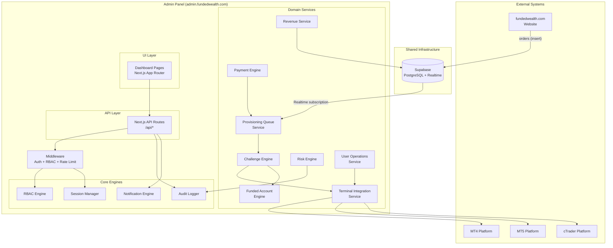
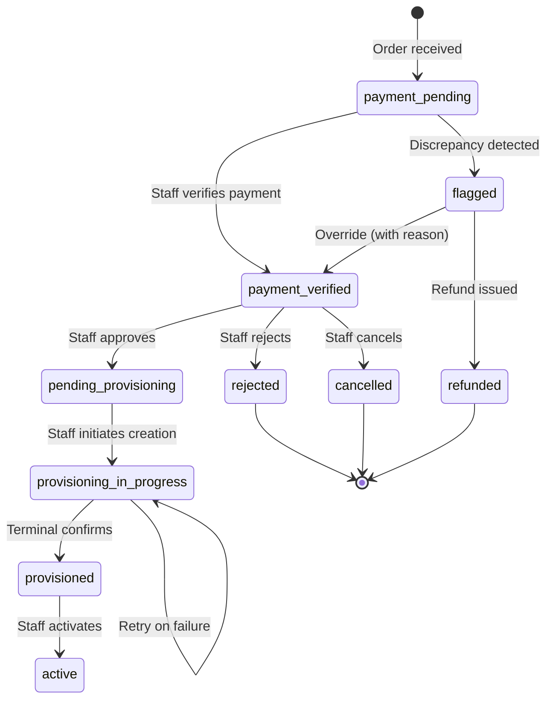
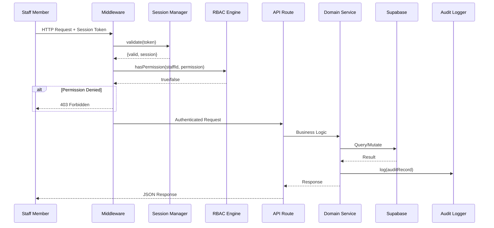

# Design Document: Admin Account Provisioning

## Overview

This design transforms the FundedWealth Admin Panel from a read-only dashboard into the single operational control center and exclusive account provisioning authority for the prop trading firm. The system implements a queue-based provisioning pipeline where all paid users from fundedwealth.com enter a processing queue before receiving trading accounts. The Admin Panel orchestrates the complete lifecycle: payment verification → queue ingestion → challenge account creation → terminal provisioning → funded account promotion.

### Key Design Decisions

1. **Single Authority Pattern**: Admin is the ONLY system that can create Challenge or Funded accounts. The website inserts orders; Admin provisions accounts.
2. **Shared Supabase Project**: Website, Admin, and Terminal share one Supabase instance. `users.id` (UUID) is the canonical identity across all systems.
3. **Event-Driven Queue Ingestion**: Orders arrive via Supabase Realtime subscriptions or webhook, not polling.
4. **Stateful Workflow Engine**: Provisioning follows a strict state machine with enforced transitions.
5. **Platform Adapter Pattern**: Terminal integration uses an adapter interface supporting MT4/MT5/cTrader without code changes.

## Architecture

### High-Level System Diagram



### Provisioning State Machine



### Request Flow



## Components and Interfaces

### 1. Provisioning Queue Service (`src/lib/provisioning/queue.ts`)

Manages the ingestion, ordering, and lifecycle of provisioning queue entries.

```typescript
interface ProvisioningQueueEntry {
  id: string;
  order_id: string;
  user_id: string;
  challenge_type: string;
  account_size: number;
  payment_amount: number;
  payment_method: string;
  payment_reference: string;
  payment_verified_at: string;
  provisioning_status: ProvisioningStatus;
  payment_flag: string | null;
  override_reason: string | null;
  created_at: string;
  updated_at: string;
}

type ProvisioningStatus =
  | 'payment_pending'
  | 'payment_verified'
  | 'pending_provisioning'
  | 'provisioning_in_progress'
  | 'provisioned'
  | 'active'
  | 'rejected'
  | 'cancelled'
  | 'refunded';

interface ProvisioningQueueService {
  /** Ingest a new order from the website */
  ingest(order: IngestOrderInput): Promise<ProvisioningQueueEntry>;
  
  /** Transition an entry to the next valid state */
  transition(
    entryId: string,
    targetStatus: ProvisioningStatus,
    actorId: string,
    reason?: string
  ): Promise<ProvisioningQueueEntry>;
  
  /** Query queue entries with pagination and filters */
  query(filters: QueueFilters): Promise<PaginatedResult<ProvisioningQueueEntry>>;
  
  /** Get pipeline stage counts */
  getPipelineCounts(): Promise<Record<ProvisioningStatus, number>>;
  
  /** Get entries stale for >24h in any stage */
  getStaleEntries(): Promise<ProvisioningQueueEntry[]>;
}
```

#### State Transition Validation

```typescript
const VALID_TRANSITIONS: Record<ProvisioningStatus, ProvisioningStatus[]> = {
  payment_pending: ['payment_verified', 'refunded'],
  payment_verified: ['pending_provisioning', 'rejected', 'cancelled'],
  pending_provisioning: ['provisioning_in_progress'],
  provisioning_in_progress: ['provisioned'],
  provisioned: ['active'],
  active: [],
  rejected: [],
  cancelled: [],
  refunded: [],
};

function isValidTransition(from: ProvisioningStatus, to: ProvisioningStatus): boolean {
  return VALID_TRANSITIONS[from]?.includes(to) ?? false;
}
```

### 2. Challenge Engine (`src/lib/challenges/engine.ts`)

Handles challenge account CRUD, state transitions, batch operations, and rules configuration.

```typescript
interface ChallengeEngine {
  /** Create a challenge account from provisioning queue */
  create(input: CreateChallengeInput, actorId: string): Promise<ChallengeAccount>;
  
  /** Transition challenge status with validation */
  transition(
    challengeId: string,
    action: ChallengeAction,
    actorId: string,
    options?: { reason: string; override?: boolean; justification?: string }
  ): Promise<ChallengeAccount>;
  
  /** Batch state transitions (max 50) */
  batchTransition(
    ids: string[],
    action: ChallengeAction,
    actorId: string,
    reason: string
  ): Promise<BatchResult<ChallengeAccount>>;
  
  /** Pause a challenge (freeze trading days) */
  pause(challengeId: string, actorId: string, reason: string): Promise<ChallengeAccount>;
  
  /** Resume a paused challenge */
  resume(challengeId: string, actorId: string, reason: string): Promise<ChallengeAccount>;
  
  /** Generate unique account number */
  generateAccountNumber(): string;
}

type ChallengeAction = 'pass' | 'fail' | 'retry' | 'reset' | 'extend' | 'archive' | 'restore';

interface CreateChallengeInput {
  user_id: string;
  challenge_type: string;
  account_size: number;
  provisioning_queue_id?: string;
}

interface BatchResult<T> {
  successful: Array<{ id: string; result: T }>;
  failed: Array<{ id: string; error: string }>;
}
```

### 3. Challenge Rules Service (`src/lib/challenges/rules.ts`)

Manages versioned challenge rule configurations.

```typescript
interface ChallengeRule {
  id: string;
  challenge_type: string;
  account_size: number;
  profit_target_pct: number;
  daily_drawdown_limit_pct: number;
  max_drawdown_limit_pct: number;
  min_trading_days: number;
  max_trading_days: number;
  prohibited_strategies: string[];
  version: number;
  is_active: boolean;
  created_by: string;
  created_at: string;
}

interface ChallengeRulesService {
  /** Get active rule for a challenge type + size combination */
  getActiveRule(challengeType: string, accountSize: number): Promise<ChallengeRule | null>;
  
  /** Create a new rule (auto-increments version) */
  create(input: CreateRuleInput, actorId: string): Promise<ChallengeRule>;
  
  /** Deactivate a rule version */
  deactivate(ruleId: string, actorId: string): Promise<void>;
  
  /** List all rules grouped by challenge_type */
  listGrouped(): Promise<Record<string, ChallengeRule[]>>;
  
  /** Validate rule parameters */
  validate(input: CreateRuleInput): ValidationResult;
}

interface CreateRuleInput {
  challenge_type: string;
  account_size: number;       // 1,000 - 10,000,000
  profit_target_pct: number;  // 1 - 100
  daily_drawdown_limit_pct: number;  // 1 - 50
  max_drawdown_limit_pct: number;    // 1 - 100
  min_trading_days: number;   // 1 - 365
  max_trading_days: number;   // 1 - 365, >= min_trading_days
  prohibited_strategies: string[];  // max 20, each max 100 chars
}
```

### 4. Funded Account Engine (`src/lib/funded/engine.ts`)

Manages funded account creation from passed challenges and lifecycle operations.

```typescript
interface FundedAccountEngine {
  /** Create funded account from passed challenge */
  create(input: CreateFundedInput, actorId: string): Promise<FundedAccount>;
  
  /** Apply scaling adjustment (0.5x - 4.0x) */
  createWithScaling(
    challengeAccountId: string,
    scalingMultiplier: number,
    actorId: string
  ): Promise<FundedAccount>;
  
  /** Suspend a funded account (also deactivates terminal) */
  suspend(accountId: string, actorId: string, reason: string): Promise<FundedAccount>;
  
  /** Close a funded account */
  close(accountId: string, actorId: string, reason: string): Promise<FundedAccount>;
  
  /** Mark account as breached */
  breach(accountId: string, actorId: string): Promise<FundedAccount>;
}

interface CreateFundedInput {
  challenge_account_id: string;
  scaling_multiplier?: number;  // 0.5 - 4.0, defaults to 1.0
}

interface FundedAccountRule {
  id: string;
  min_account_size: number;
  max_account_size: number;
  profit_split_pct: number;
  daily_drawdown_limit_pct: number;
  max_drawdown_limit_pct: number;
}
```

### 5. Terminal Integration Service (`src/lib/terminal/service.ts`)

Platform adapter for MT4/MT5/cTrader with configurable connection parameters.

```typescript
interface TerminalPlatformAdapter {
  /** Provision a new trading account on the platform */
  createAccount(params: TerminalAccountParams): Promise<TerminalAccountResult>;
  
  /** Activate an account (enable login) */
  activate(platformAccountId: string): Promise<void>;
  
  /** Deactivate an account (disable login) */
  deactivate(platformAccountId: string): Promise<void>;
  
  /** Regenerate credentials */
  regenerateCredentials(platformAccountId: string): Promise<TerminalCredentials>;
  
  /** Check platform health */
  healthCheck(): Promise<{ healthy: boolean; latencyMs: number }>;
}

interface TerminalAccountParams {
  account_type: 'challenge' | 'funded';
  initial_balance: number;
  leverage: number;        // 1 - 500
  trading_group: string;
}

interface TerminalAccountResult {
  platform_account_id: string;
  server_name: string;
  login_id: string;
}

interface TerminalCredentials {
  login_id: string;
  one_time_password: string;  // encrypted at rest
  server_address: string;
}
```

```typescript
// Platform adapter factory - supports runtime configuration
interface TerminalConfig {
  platform: 'mt4' | 'mt5' | 'ctrader';
  api_url: string;
  api_key: string;
  timeout_ms: number;  // default 30000
  max_retries: number; // default 3
}

class TerminalIntegrationService {
  private adapters: Map<string, TerminalPlatformAdapter>;
  
  constructor() {
    this.adapters = new Map();
  }
  
  /** Register a platform adapter (loaded from DB config) */
  registerAdapter(platform: string, adapter: TerminalPlatformAdapter): void;
  
  /** Get adapter for a platform type */
  getAdapter(platform: string): TerminalPlatformAdapter;
  
  /** Provision with retry logic (max 3 retries) */
  async provisionWithRetry(
    platform: string,
    params: TerminalAccountParams,
    maxRetries?: number
  ): Promise<TerminalAccountResult>;
}
```

### 6. Payment Engine (`src/lib/payments/engine.ts`)

Handles payment verification, flagging, and override workflows.

```typescript
interface PaymentEngine {
  /** Store payment details from incoming order */
  storePayment(input: StorePaymentInput): Promise<void>;
  
  /** Verify a payment (staff action) */
  verify(orderId: string, actorId: string): Promise<void>;
  
  /** Flag a payment with discrepancy type */
  flag(orderId: string, discrepancyType: PaymentFlag): Promise<void>;
  
  /** Override a flagged payment (requires reason) */
  override(orderId: string, actorId: string, reason: string): Promise<void>;
  
  /** Process refund */
  refund(orderId: string, actorId: string, reason: string): Promise<void>;
  
  /** Detect discrepancies automatically */
  detectDiscrepancies(order: IncomingOrder): PaymentFlag | null;
}

type PaymentFlag = 'amount_mismatch' | 'duplicate_reference' | 'gateway_failure';

interface StorePaymentInput {
  order_id: string;
  amount: number;        // 0.01 - 999,999.99
  currency: string;      // ISO 4217
  payment_method: string;
  transaction_reference: string;  // max 255 chars
  payment_gateway_response: Record<string, unknown>;
}
```

### 7. Risk Engine (`src/lib/risk/engine.ts`)

Handles risk alert actions, breach detection, and automated responses.

```typescript
interface RiskEngine {
  /** Acknowledge a risk alert */
  acknowledge(alertId: string, actorId: string): Promise<RiskAlert>;
  
  /** Resolve a risk alert */
  resolve(
    alertId: string,
    actorId: string,
    outcome: ResolutionOutcome,
    actionTaken: string
  ): Promise<RiskAlert>;
  
  /** Escalate a risk alert */
  escalate(alertId: string, actorId: string, reason: string): Promise<RiskAlert>;
  
  /** Suspend account from risk alert */
  suspendAccount(alertId: string, actorId: string): Promise<void>;
  
  /** Automated breach detection (called by cron/realtime) */
  checkBreaches(accountId: string): Promise<RiskAlert[]>;
  
  /** Create automated breach alert */
  createBreachAlert(
    accountId: string,
    breachType: 'daily_drawdown' | 'max_drawdown',
    breachAmount: number,
    thresholdViolated: number
  ): Promise<RiskAlert>;
}

type ResolutionOutcome = 'account_suspended' | 'rule_adjusted' | 'false_positive' | 'escalated';

const RISK_ALERT_TRANSITIONS: Record<string, string[]> = {
  open: ['acknowledged', 'escalated'],
  acknowledged: ['resolved', 'escalated'],
  escalated: ['resolved'],
  resolved: [],
};
```

### 8. User Operations Service (`src/lib/users/operations.ts`)

Handles user suspend, ban, reactivate, and KYC operations.

```typescript
interface UserOperationsService {
  /** Suspend a user and cascade to all accounts */
  suspend(userId: string, actorId: string, reason: string): Promise<void>;
  
  /** Ban a user permanently */
  ban(userId: string, actorId: string, reason: string): Promise<void>;
  
  /** Reactivate a suspended user */
  activate(userId: string, actorId: string): Promise<{ restorable: FundedAccount[] }>;
  
  /** Restore individual funded accounts after reactivation */
  restoreFundedAccount(accountId: string, actorId: string): Promise<void>;
  
  /** Approve KYC submission */
  approveKyc(submissionId: string, actorId: string): Promise<void>;
  
  /** Reject KYC submission with reason */
  rejectKyc(submissionId: string, actorId: string, reason: string): Promise<void>;
}
```

### 9. Revenue Service (`src/lib/revenue/service.ts`)

Calculates real revenue metrics from order and payout data.

```typescript
interface RevenueService {
  /** Get revenue for date range, grouped by period */
  getRevenue(dateRange: DateRange, groupBy: 'day' | 'week' | 'month'): Promise<RevenueData[]>;
  
  /** Get breakdown by challenge type and account size */
  getBreakdown(dateRange: DateRange): Promise<RevenueBreakdown>;
  
  /** Calculate net revenue (gross - refunds - payouts) */
  getNetRevenue(dateRange: DateRange): Promise<NetRevenueData>;
}

interface RevenueData {
  period: string;
  gross_revenue: number;
  refunds: number;
  payouts: number;
  net_revenue: number;
  order_count: number;
}

interface RevenueBreakdown {
  by_challenge_type: Record<string, number>;
  by_account_size: Record<number, number>;
}
```

### 10. Middleware Enhancement (`src/middleware.ts`)

The middleware must be updated to remove the auth bypass and enforce session + RBAC on every request.

```typescript
// Key changes:
// 1. REMOVE: `return NextResponse.next()` dev bypass
// 2. ADD: Session token extraction from cookie
// 3. ADD: Session validation via SessionManager
// 4. ADD: RBAC permission check via RBACEngine
// 5. ADD: Staff ID injection into request headers for downstream use

// Session extraction helper for API routes
async function extractStaffId(request: NextRequest): Promise<string | null> {
  const token = request.cookies.get('session_token')?.value;
  if (!token) return null;
  const result = await sessionManager.validate(token);
  if (!result.valid || !result.session) return null;
  await sessionManager.refresh(token);
  return result.session.staffId;
}
```

### 11. API Route Layer

All API routes follow a consistent pattern using a shared handler wrapper:

```typescript
// src/lib/api/handler.ts
interface ApiHandlerOptions {
  permission?: Permission;      // Required permission for this action
  method?: 'GET' | 'POST' | 'PUT' | 'PATCH' | 'DELETE';
  allowFounderBypass?: boolean; // Default true
}

type ApiHandler = (
  request: NextRequest,
  context: { staffId: string; staffRole: string; params?: Record<string, string> }
) => Promise<NextResponse>;

function withAuth(handler: ApiHandler, options: ApiHandlerOptions): (req: NextRequest, ctx: any) => Promise<NextResponse> {
  return async (request, routeContext) => {
    // 1. Extract & validate session
    const staffId = await extractStaffId(request);
    if (!staffId) return NextResponse.json({ error: { code: 'UNAUTHORIZED' } }, { status: 401 });
    
    // 2. Check permission
    if (options.permission) {
      const allowed = await rbacEngine.hasPermission(staffId, options.permission);
      if (!allowed) {
        await auditLogger.logDenied({ ... });
        return NextResponse.json({ error: { code: 'FORBIDDEN' } }, { status: 403 });
      }
    }
    
    // 3. Get staff role for audit
    const roles = await rbacEngine.getStaffRoles(staffId);
    const staffRole = roles[0] || 'staff';
    
    // 4. Execute handler
    return handler(request, { staffId, staffRole, params: routeContext.params });
  };
}
```

#### API Endpoint Summary

| Endpoint | Method | Permission | Description |
|----------|--------|-----------|-------------|
| `/api/provisioning/queue` | GET | `challenges.view` | List provisioning queue |
| `/api/provisioning/queue/[id]/transition` | POST | `challenges.manage` | Transition provisioning state |
| `/api/provisioning/queue/ingest` | POST | (webhook/internal) | Ingest order from website |
| `/api/challenges` | POST | `challenges.create` | Create challenge account |
| `/api/challenges/[id]/[action]` | POST | `challenges.manage` | Challenge state transitions |
| `/api/challenges/batch` | POST | `challenges.manage` | Batch operations (max 50) |
| `/api/challenges/rules` | GET/POST | `settings.manage` (write) | Challenge rules CRUD |
| `/api/funded` | POST | `funded.create` | Create funded account |
| `/api/funded/[id]/[action]` | POST | `funded.manage` | Funded account actions |
| `/api/terminal/provision` | POST | `challenges.manage` | Trigger terminal provisioning |
| `/api/terminal/credentials/[id]` | POST | `challenges.manage` | Credential operations |
| `/api/users/[id]/suspend` | POST | `users.ban` | Suspend user |
| `/api/users/[id]/ban` | POST | `users.ban` | Ban user |
| `/api/users/[id]/activate` | POST | `users.ban` | Reactivate user |
| `/api/kyc/[id]/approve` | POST | `kyc.manage` | Approve KYC |
| `/api/kyc/[id]/reject` | POST | `kyc.manage` | Reject KYC |
| `/api/risk/[id]/[action]` | POST | `risk.manage` | Risk alert actions |
| `/api/payouts/[id]/[action]` | POST | `payouts.approve` | Payout actions |
| `/api/payments/[id]/verify` | POST | `payments.verify` | Verify payment |
| `/api/payments/[id]/override` | POST | `payments.override` | Override flagged payment |
| `/api/executive/revenue` | GET | `revenue.view` | Revenue metrics |
| `/api/config/flags` | GET/POST | `settings.manage` (write) | Feature flags |
| `/api/staff` | POST | `staff.create` | Create staff member |
| `/api/founder/emergency/[action]` | POST | (Founder only) | Emergency controls |
| `/api/founder/search` | GET | (Founder only) | Global search |

## Data Models

### New Database Tables

#### `provisioning_queue`

| Column | Type | Constraints | Description |
|--------|------|-------------|-------------|
| id | uuid | PK, default gen_random_uuid() | Queue entry ID |
| order_id | text | UNIQUE NOT NULL | Order ID from website |
| user_id | uuid | FK → users.id, NOT NULL | Trader identity |
| challenge_type | text | NOT NULL | e.g., "standard", "aggressive" |
| account_size | numeric | NOT NULL, > 0 | Account size in USD |
| payment_amount | numeric | NOT NULL, 0.01–999999.99 | Payment amount |
| payment_method | text | NOT NULL | Payment method used |
| payment_reference | text | NOT NULL, max 255 | Transaction reference |
| payment_gateway_response | jsonb | | Raw gateway response |
| payment_verified_at | timestamptz | | When payment was verified |
| payment_flag | text | | Discrepancy type if flagged |
| provisioning_status | text | NOT NULL, default 'payment_pending' | Current lifecycle state |
| override_reason | text | | Override justification |
| rejection_reason | text | | Rejection justification |
| assigned_challenge_id | uuid | FK → challenge_accounts.id | Created challenge |
| retry_count | int | default 0 | Terminal provisioning retries |
| created_at | timestamptz | default now() | |
| updated_at | timestamptz | default now() | |

#### `challenge_rules`

| Column | Type | Constraints | Description |
|--------|------|-------------|-------------|
| id | uuid | PK | Rule ID |
| challenge_type | text | NOT NULL | Challenge type identifier |
| account_size | numeric | NOT NULL, 1000–10000000 | Account size tier |
| profit_target_pct | numeric | NOT NULL, 1–100 | Profit target % |
| daily_drawdown_limit_pct | numeric | NOT NULL, 1–50 | Daily drawdown limit % |
| max_drawdown_limit_pct | numeric | NOT NULL, 1–100 | Max drawdown limit % |
| min_trading_days | int | NOT NULL, 1–365 | Minimum trading days |
| max_trading_days | int | NOT NULL, 1–365, >= min | Maximum trading days |
| prohibited_strategies | text[] | max 20 items, each max 100 chars | Banned strategies |
| version | int | NOT NULL | Auto-incremented version |
| is_active | boolean | default true | Whether rule is current |
| created_by | uuid | FK → staff_members.id | Creator |
| created_at | timestamptz | default now() | |

**Unique constraint**: `(challenge_type, account_size, version)`

#### `funded_account_rules`

| Column | Type | Constraints | Description |
|--------|------|-------------|-------------|
| id | uuid | PK | Rule ID |
| min_account_size | numeric | NOT NULL | Lower bound (inclusive) |
| max_account_size | numeric | NOT NULL | Upper bound (inclusive) |
| profit_split_pct | numeric | NOT NULL, 1–100 | Profit split for trader |
| daily_drawdown_limit_pct | numeric | NOT NULL, 1–50 | Daily DD limit |
| max_drawdown_limit_pct | numeric | NOT NULL, 1–100 | Max DD limit |
| is_active | boolean | default true | |
| created_at | timestamptz | default now() | |

#### `challenge_timeline`

| Column | Type | Constraints | Description |
|--------|------|-------------|-------------|
| id | uuid | PK | Timeline entry ID |
| challenge_account_id | uuid | FK → challenge_accounts.id | Target challenge |
| action | text | NOT NULL | e.g., "challenge.create", "challenge.pause" |
| actor_id | uuid | FK → staff_members.id | Who performed it |
| reason | text | | Justification text |
| metadata | jsonb | | Additional context |
| created_at | timestamptz | default now() | |

#### `terminal_accounts`

| Column | Type | Constraints | Description |
|--------|------|-------------|-------------|
| id | uuid | PK | Internal ID |
| account_id | uuid | NOT NULL | FK → challenge or funded account |
| account_type | text | NOT NULL | 'challenge' or 'funded' |
| platform | text | NOT NULL | 'mt4', 'mt5', 'ctrader' |
| platform_account_id | text | NOT NULL | External platform ID |
| server_name | text | NOT NULL | Platform server |
| login_id | text | NOT NULL | Login credential |
| encrypted_password | text | | Encrypted one-time password |
| credential_status | text | default 'pending' | 'pending', 'ready_for_delivery', 'delivered', 'regenerated' |
| activation_status | text | default 'inactive' | 'active', 'inactive' |
| delivery_timestamp | timestamptz | | When credentials were sent |
| delivery_method | text | | 'email' |
| created_at | timestamptz | default now() | |
| updated_at | timestamptz | default now() | |

#### `feature_flags`

| Column | Type | Constraints | Description |
|--------|------|-------------|-------------|
| id | uuid | PK | Flag ID |
| name | text | UNIQUE NOT NULL | Flag identifier |
| description | text | | Human-readable description |
| enabled | boolean | default false | Current state |
| scope | text | default 'global' | 'global', 'staff', 'traders' |
| created_by | uuid | FK → staff_members.id | |
| created_at | timestamptz | default now() | |
| updated_at | timestamptz | default now() | |

#### `kyc_submissions`

| Column | Type | Constraints | Description |
|--------|------|-------------|-------------|
| id | uuid | PK | Submission ID |
| user_id | uuid | FK → users.id | Trader |
| document_type | text | NOT NULL | ID type |
| document_url | text | NOT NULL | Storage path |
| status | text | default 'pending' | 'pending', 'approved', 'rejected' |
| reviewer_id | uuid | FK → staff_members.id | |
| rejection_reason | text | | |
| reviewed_at | timestamptz | | |
| submitted_at | timestamptz | default now() | |

### Extended Columns on Existing Tables

#### `challenge_accounts` (additions)

| Column | Type | Description |
|--------|------|-------------|
| platform_account_id | text | Terminal platform external ID |
| server_name | text | Platform server name |
| login_id | text | Platform login credential |
| provisioning_queue_id | uuid | FK → provisioning_queue.id |

#### `funded_accounts` (additions)

| Column | Type | Description |
|--------|------|-------------|
| platform_account_id | text | Terminal platform external ID |
| server_name | text | Platform server name |
| login_id | text | Platform login credential |
| scaling_multiplier | numeric | Applied scaling (0.5–4.0) |

#### `users` (additions)

| Column | Type | Description |
|--------|------|-------------|
| suspension_reason | text | Why user was suspended |
| suspension_timestamp | timestamptz | When suspended |

### New Permissions Required

The following permissions must be added to the `ALL_PERMISSIONS` array in `src/types/permissions.ts`:

```typescript
// New permissions for provisioning system
'challenges.create',    // Create challenge accounts
'challenges.override',  // Override min_trading_days check
'funded.create',        // Create funded accounts  
'funded.manage',        // Funded account state transitions
'users.suspend',        // Suspend/ban/activate users (replaces overloading users.ban)
'payments.verify',      // Verify payments
'payments.override',    // Override flagged payments
'risk.critical',        // Resolve critical risk alerts
'staff.create',         // Create new staff members
'kyc.manage',           // Approve/reject KYC (already exists)
'settings.manage',      // Manage challenge rules (already exists)
```

### Zod Validation Schemas

```typescript
// src/lib/provisioning/schemas.ts
import { z } from 'zod';

export const IngestOrderSchema = z.object({
  order_id: z.string().min(1),
  user_id: z.string().uuid(),
  challenge_type: z.string().min(1),
  account_size: z.number().positive(),
  payment_amount: z.number().min(0.01).max(999999.99),
  payment_method: z.string().min(1),
  payment_reference: z.string().min(1).max(255),
  payment_verified_at: z.string().datetime(),
});

export const CreateChallengeSchema = z.object({
  user_id: z.string().uuid(),
  challenge_type: z.string().min(1),
  account_size: z.number().positive(),
});

export const ChallengeRuleSchema = z.object({
  challenge_type: z.string().min(1),
  account_size: z.number().min(1000).max(10000000),
  profit_target_pct: z.number().min(1).max(100),
  daily_drawdown_limit_pct: z.number().min(1).max(50),
  max_drawdown_limit_pct: z.number().min(1).max(100),
  min_trading_days: z.number().int().min(1).max(365),
  max_trading_days: z.number().int().min(1).max(365),
  prohibited_strategies: z.array(z.string().max(100)).max(20).default([]),
}).refine(data => data.max_trading_days >= data.min_trading_days, {
  message: 'max_trading_days must be >= min_trading_days',
  path: ['max_trading_days'],
});

export const CreateFundedSchema = z.object({
  challenge_account_id: z.string().uuid(),
  scaling_multiplier: z.number().min(0.5).max(4.0).optional().default(1.0),
});

export const SuspendUserSchema = z.object({
  reason: z.string().min(10).max(1000),
});

export const BanUserSchema = z.object({
  reason: z.string().min(10).max(1000),
});

export const RiskResolveSchema = z.object({
  resolution_outcome: z.enum(['account_suspended', 'rule_adjusted', 'false_positive', 'escalated']),
  action_taken: z.string().min(20).max(2000),
});

export const PaymentOverrideSchema = z.object({
  reason: z.string().min(20),
});
```

## Correctness Properties

*A property is a characteristic or behavior that should hold true across all valid executions of a system — essentially, a formal statement about what the system should do. Properties serve as the bridge between human-readable specifications and machine-verifiable correctness guarantees.*

### Property 1: Provisioning State Machine Enforcement

*For any* provisioning queue entry in state S, and *for any* requested transition to state T, if T is not in the valid transitions map for S, the transition SHALL be rejected and the entry SHALL remain in state S.

**Validates: Requirements 2.7, 10.5, 22.4**

### Property 2: Order Ingestion Idempotency

*For any* valid order with a given order_id, ingesting it N times (N >= 1) SHALL result in exactly one provisioning queue entry with that order_id.

**Validates: Requirements 1.1, 1.7**

### Property 3: Input Validation Rejects Invalid Data

*For any* input payload that violates its Zod validation schema (missing required fields, out-of-range values, invalid types), the system SHALL reject the request with a 400 status and field-specific error messages, and no database mutation SHALL occur.

**Validates: Requirements 1.6, 3.2, 4.6, 4.7**

### Property 4: Challenge Parameter Derivation from Highest-Version Rule

*For any* challenge account creation with a given challenge_type and account_size, the system SHALL resolve the active rule with the highest version number for that type+size combination, and the created account's profit_target_pct, daily_drawdown_limit_pct, max_drawdown_limit_pct, min_trading_days, and max_trading_days SHALL equal the resolved rule's values.

**Validates: Requirements 3.3, 3.7, 4.4**

### Property 5: RBAC Permission Enforcement

*For any* API mutation endpoint and *for any* staff member who does not hold the required permission and is not assigned a Founder or Co-Founder role, the system SHALL return HTTP 403 and perform no database write.

**Validates: Requirements 3.5, 4.5, 5.8, 6.9, 11.1, 13.5, 14.5, 15.2, 15.3, 20.1, 20.2, 20.3, 20.4, 20.5, 20.6, 20.7, 20.8, 20.9**

### Property 6: Audit Record Creation on Every Mutation

*For any* state-changing operation that completes successfully, the system SHALL create an audit_records entry where actor_id matches the authenticated session's staff_id (never a hardcoded placeholder), actor_role reflects the staff member's highest-privilege role, and the previous_state and new_state accurately reflect the change.

**Validates: Requirements 2.8, 3.9, 11.8, 12.4, 13.7, 15.5, 19.1, 19.2, 19.3, 19.4, 19.5, 23.1, 23.2, 23.3, 23.4, 23.5**

### Property 7: Session Validation Invariant

*For any* incoming request to a protected route, if the session token is missing, expired (created > 8 hours ago), or idle (last_activity > 30 minutes ago), the system SHALL reject the request (401 for API, redirect for pages) before executing any business logic.

**Validates: Requirements 18.1, 18.2, 18.3, 18.4, 18.5**

### Property 8: Challenge Pause/Resume Round Trip

*For any* active challenge account with trading_days_completed = D, pausing and then resuming the account SHALL result in the account being in `active` status with trading_days_completed still equal to D.

**Validates: Requirements 5.2, 5.3**

### Property 9: Funded Account Size Derivation

*For any* funded account creation from a passed challenge with initial_balance B and scaling multiplier M (where 0.5 ≤ M ≤ 4.0, default 1.0), the funded account's account_size SHALL equal B × M.

**Validates: Requirements 6.3, 6.4**

### Property 10: Breach Detection Threshold

*For any* funded account where daily_drawdown_used_pct > daily_drawdown_limit_pct, the system SHALL create a Risk_Alert with severity `high`. *For any* funded account where max_drawdown_used_pct > max_drawdown_limit_pct, the system SHALL create a Risk_Alert with severity `critical`.

**Validates: Requirements 12.1, 12.2**

### Property 11: User Suspension/Ban Cascade

*For any* user suspension action, all associated challenge_accounts SHALL transition to `archived` and all associated funded_accounts SHALL transition to `suspended`. *For any* user ban action, all associated challenge_accounts SHALL transition to `archived` and all associated funded_accounts SHALL transition to `closed`.

**Validates: Requirements 13.2, 13.3**

### Property 12: User Status Transition Enforcement

*For any* user with account_status `suspended` or `banned`, a suspend action SHALL be rejected. *For any* user with account_status `banned`, a reactivate action SHALL be rejected.

**Validates: Requirements 13.8, 13.9**

### Property 13: Risk Alert State Machine

*For any* risk alert in state S and *for any* action A, if A is not in the valid transitions for S (open → [acknowledged, escalated]; acknowledged → [resolved, escalated]; escalated → [resolved]), the action SHALL be rejected and the alert SHALL remain in state S.

**Validates: Requirements 11.6, 11.7**

### Property 14: Funded Account Eligibility Gate

*For any* funded account creation attempt, if the referenced challenge_account's status is not `passed`, OR if a funded account already exists for that challenge_account_id, the creation SHALL be rejected.

**Validates: Requirements 6.7, 6.8**

### Property 15: KYC Verification Gate for Funded Activation

*For any* trader whose kyc_status is not `verified`, the system SHALL prevent funded account activation.

**Validates: Requirements 14.3**

### Property 16: Batch Operation Partial Failure Handling

*For any* batch of N challenge accounts (N ≤ 50) submitted for a state transition, each account SHALL be processed independently. Valid accounts SHALL succeed, invalid accounts SHALL fail with individual error reasons, and no valid account's processing SHALL be blocked by an invalid account's failure.

**Validates: Requirements 5.4, 5.5**

### Property 17: Account Number Uniqueness

*For any* two challenge accounts or funded accounts in the system, their account_number values SHALL be distinct.

**Validates: Requirements 3.6**

### Property 18: Challenge Rule Versioning Immutability

*For any* rule modification, the previous version record SHALL remain unchanged in the database, and the new rule SHALL have a version number exactly one greater than the previous highest version for that challenge_type + account_size combination.

**Validates: Requirements 4.3**

### Property 19: Net Revenue Calculation

*For any* date range, the net_revenue value SHALL equal the sum of completed order amounts minus the sum of refunded amounts minus the sum of completed payout amounts for that period.

**Validates: Requirements 21.3**

### Property 20: Override Requires Minimum Justification

*For any* override action (payment override requiring 20 chars, challenge pass override requiring 20 chars with override flag, risk resolution requiring 20-2000 chars), if the provided justification is shorter than the minimum or the override flag is missing, the action SHALL be rejected.

**Validates: Requirements 5.7, 10.4, 11.2**

### Property 21: Provisioning Queue Sort Order

*For any* query of the provisioning queue, the returned entries SHALL be sorted by payment_verified_at in ascending order (oldest first), with each page containing at most 25 entries.

**Validates: Requirements 1.3**

### Property 22: Payment Discrepancy Detection

*For any* incoming order where the payment amount differs from the order amount, OR the transaction_reference matches an existing order, OR the gateway response indicates failure, the system SHALL flag the order with the corresponding discrepancy type and prevent automatic queue entry.

**Validates: Requirements 10.3**

### Property 23: Terminal Provisioning Retry Limit

*For any* terminal account provisioning attempt that fails, the system SHALL allow up to 3 additional retry attempts. After 3 failed retries, the account SHALL remain in `provisioning_in_progress` status without further automatic retries.

**Validates: Requirements 7.3**

### Property 24: Founder/Co-Founder RBAC Bypass

*For any* action performed by a staff member with Founder or Co-Founder role, the RBAC_Engine SHALL return true for all permission checks regardless of explicit permission assignments.

**Validates: Requirements 20.9**

## Error Handling

### Error Response Format

All API errors follow a consistent JSON structure:

```typescript
interface ApiError {
  error: {
    code: string;           // Machine-readable error code
    message: string;        // Human-readable description
    details?: Record<string, string>;  // Field-specific validation errors
    retryAfter?: number;    // Seconds until retry (for rate limits)
  };
}
```

### Error Code Registry

| Code | HTTP Status | Description |
|------|------------|-------------|
| `UNAUTHORIZED` | 401 | No valid session token |
| `FORBIDDEN` | 403 | Insufficient permissions |
| `NOT_FOUND` | 404 | Entity does not exist |
| `USER_NOT_FOUND` | 404 | Referenced user_id not in users table |
| `VALIDATION_ERROR` | 400 | Request body fails Zod schema validation |
| `INVALID_ACTION` | 400 | Unknown action parameter |
| `INVALID_TRANSITION` | 422 | State transition not allowed from current state |
| `DUPLICATE_ORDER` | 409 | Order with same order_id already exists |
| `DUPLICATE_FUNDED` | 409 | Funded account already exists for challenge |
| `NO_MATCHING_RULES` | 422 | No active challenge rules for type+size |
| `MIN_DAYS_NOT_MET` | 422 | Trading days requirement not satisfied |
| `OVERRIDE_REQUIRED` | 422 | Override flag and justification needed |
| `PROVISIONING_FAILED` | 500 | Terminal platform returned error |
| `RATE_LIMIT_EXCEEDED` | 429 | Too many requests |
| `INTERNAL_ERROR` | 500 | Unexpected server error |
| `TERMINAL_TIMEOUT` | 504 | Terminal platform did not respond in 30s |
| `INELIGIBLE_CHALLENGE` | 400 | Challenge not in 'passed' status |
| `USER_ALREADY_SUSPENDED` | 422 | User already suspended or banned |
| `BANNED_USER` | 422 | Banned users cannot be reactivated |
| `KYC_NOT_VERIFIED` | 422 | KYC must be verified before funded activation |

### Error Handling Strategy

1. **Validation errors** (400): Return immediately with field-specific messages. No DB write occurs.
2. **Permission errors** (403): Log a denied audit record, return immediately.
3. **State transition errors** (422): Return current state and valid transitions. No mutation.
4. **External service failures** (Terminal API): Retain current state, increment retry counter, log failure details. Surface error to staff for manual retry.
5. **Database errors**: Wrap in try/catch, log full error, return generic 500 to client.
6. **Partial batch failures**: Process all valid items, collect errors for invalid items, return combined result.

### Idempotency

- Order ingestion is idempotent via `order_id` unique constraint
- State transitions are idempotent if target state equals current state (no-op)
- Funded account creation uses `challenge_account_id` unique constraint

### Retry Strategy

| Operation | Max Retries | Backoff | Timeout |
|-----------|------------|---------|---------|
| Terminal provisioning | 3 | None (manual) | 30s per attempt |
| Credential delivery | 3 | None (manual) | 15s per attempt |
| Supabase writes | 2 | 100ms, 500ms | 10s |

## Testing Strategy

### Testing Framework

- **Unit & Property Tests**: Vitest + fast-check (property-based testing library for TypeScript)
- **Integration Tests**: Vitest with Supabase test client
- **E2E Tests**: Playwright (already configured in the project)
- **Minimum property test iterations**: 100 per property

### Property-Based Testing Approach

Property-based tests validate the 24 correctness properties defined above. Each property test:
- Uses `fast-check` to generate randomized inputs
- Runs a minimum of 100 iterations per property
- Is tagged with a comment referencing the design property number
- Tests pure business logic functions in isolation (state machine, validation, derivation)

**Library**: `fast-check` (add to devDependencies)

**Configuration**: Each property test runs with `{ numRuns: 100 }` minimum.

**Tag Format**: `// Feature: admin-account-provisioning, Property {N}: {title}`

### Test Organization

```
src/
├── __tests__/
│   ├── properties/
│   │   ├── provisioning-state-machine.property.test.ts
│   │   ├── input-validation.property.test.ts
│   │   ├── rule-derivation.property.test.ts
│   │   ├── rbac-enforcement.property.test.ts
│   │   ├── audit-creation.property.test.ts
│   │   ├── session-validation.property.test.ts
│   │   ├── challenge-pause-resume.property.test.ts
│   │   ├── funded-account-sizing.property.test.ts
│   │   ├── breach-detection.property.test.ts
│   │   ├── user-cascade.property.test.ts
│   │   ├── user-status-transitions.property.test.ts
│   │   ├── risk-alert-state-machine.property.test.ts
│   │   ├── funded-eligibility.property.test.ts
│   │   ├── batch-operations.property.test.ts
│   │   ├── account-number-uniqueness.property.test.ts
│   │   ├── rule-versioning.property.test.ts
│   │   ├── revenue-calculation.property.test.ts
│   │   ├── override-justification.property.test.ts
│   │   ├── queue-sort-order.property.test.ts
│   │   ├── payment-discrepancy.property.test.ts
│   │   ├── terminal-retry.property.test.ts
│   │   └── founder-bypass.property.test.ts
│   ├── unit/
│   │   ├── provisioning-queue.test.ts
│   │   ├── challenge-engine.test.ts
│   │   ├── funded-engine.test.ts
│   │   ├── payment-engine.test.ts
│   │   ├── risk-engine.test.ts
│   │   ├── user-operations.test.ts
│   │   ├── revenue-service.test.ts
│   │   └── terminal-service.test.ts
│   └── integration/
│       ├── provisioning-flow.test.ts
│       ├── terminal-provisioning.test.ts
│       ├── credential-delivery.test.ts
│       └── end-to-end-pipeline.test.ts
```

### Unit Test Focus Areas

- Specific examples for each API endpoint (happy path + error cases)
- Edge cases: empty strings, boundary values, null fields
- Integration points between services (e.g., provisioning → challenge → terminal)
- Error recovery scenarios

### Property Test Focus Areas

Each property from the Correctness Properties section maps to a dedicated test file. Key strategies:

| Property | Generator Strategy |
|----------|-------------------|
| State Machine (1, 13) | Generate random (currentState, targetState) pairs |
| Input Validation (3) | Generate objects with random missing/invalid fields |
| Rule Derivation (4) | Generate random rules + matching creation inputs |
| RBAC (5) | Generate random (endpoint, permission set) combinations |
| Audit (6) | Execute mutations, verify audit record exists |
| Session (7) | Generate sessions with random ages/idle times |
| Pause/Resume (8) | Generate challenges with random trading_days_completed |
| Funded Sizing (9) | Generate random initial_balance × multiplier |
| Breach Detection (10) | Generate accounts with random drawdown values |
| Cascade (11) | Generate users with random numbers of associated accounts |
| Batch (16) | Generate batches with random mix of valid/invalid items |
| Revenue (19) | Generate random orders + refunds + payouts, verify arithmetic |

### Integration Test Scope

- Full provisioning pipeline: order → queue → challenge → terminal → active
- Terminal adapter communication (mocked external API)
- Credential generation and delivery flow
- Breach detection → alert → suspension flow
- Multi-step funded account promotion

