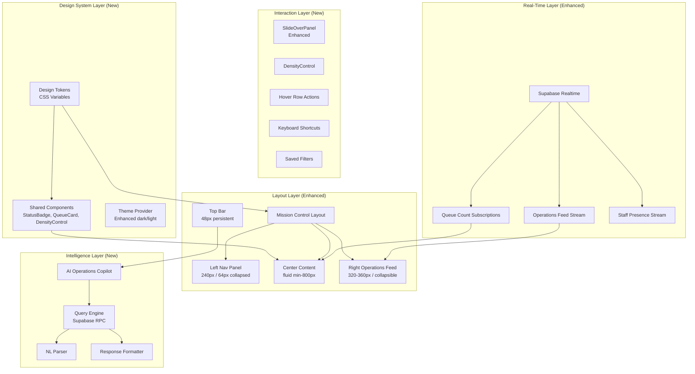
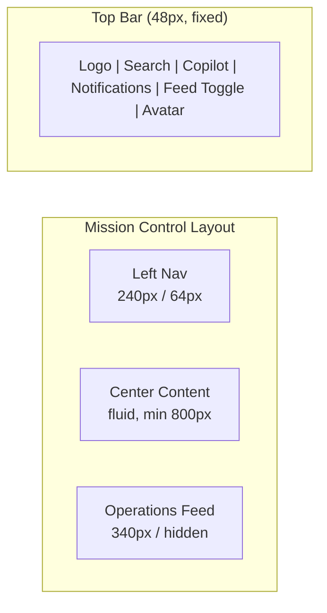

# Design Document: FundedWealth Admin OS — UI/UX Transformation

## Overview

This design specifies the visual, interaction, and information-density transformation of the existing FundedWealth Admin OS from a generic SaaS dashboard into an enterprise operations center. The transformation is **purely presentational** — no database schema changes, RBAC modifications, new business logic, or new modules are introduced.

The existing system already has 18 operating centers built as Next.js App Router pages with a working sidebar, header, command palette, data tables, slide panels, and Supabase realtime integration. This design overlays a premium fintech design system (inspired by Stripe, Linear, Vercel, and Supabase Studio), a three-panel Mission Control layout, enhanced table interactions, a live Operations Feed, and an AI Operations Copilot.

**Key Constraints:**
- Existing route structure (`src/app/(dashboard)/*`) remains unchanged
- Existing business logic, RBAC engine, and audit system are untouched
- All existing components are enhanced in-place or wrapped, not replaced from scratch
- Progressive transformation: shared layout and tokens first, then per-page density improvements

**Technology Stack (unchanged):**
- Next.js 14 App Router, TypeScript, Tailwind CSS 3.4
- shadcn/ui components, @tanstack/react-table
- Supabase (auth, database, realtime), Recharts
- lucide-react icons, class-variance-authority

---

## Architecture

### High-Level Transformation Architecture



### Transformation Strategy — Progressive Rollout

The transformation is applied in layers to avoid breaking existing functionality:

1. **Layer 1 — Design Tokens**: Replace `globals.css` variables with the new token system. All existing components that reference `--background`, `--foreground`, etc. automatically inherit the new aesthetic.
2. **Layer 2 — Layout Enhancement**: Upgrade `src/app/(dashboard)/layout.tsx` to the three-panel Mission Control Layout with collapsible regions.
3. **Layer 3 — Shared Components**: Build/enhance StatusBadge, QueueCard, DensityControl, OperationsFeed, and integrate them into the layout.
4. **Layer 4 — Table Enhancement**: Upgrade `DataTable` with sticky headers, hover actions, density controls, saved filters, and column visibility.
5. **Layer 5 — AI Copilot**: Add the Operations Copilot as a slide-over panel accessible from the top bar.
6. **Layer 6 — Per-Page Polish**: Progressive density improvements to each operating center page.

---

## Components and Interfaces

### 1. Design Token System

**File:** `src/app/globals.css` (enhanced), `src/config/theme.ts` (enhanced)

The existing token system uses HSL CSS variables. The transformation extends this with:

```css
:root {
  /* Semantic Color Scale */
  --color-background: 222 84% 4.9%;
  --color-surface: 222 47% 8%;
  --color-surface-raised: 222 47% 11%;
  --color-border: 217 33% 17.5%;
  --color-border-subtle: 217 33% 13%;
  --color-text-primary: 210 40% 98%;
  --color-text-secondary: 215 20% 65%;
  --color-text-muted: 215 16% 47%;
  --color-accent: 217 91% 60%;
  --color-success: 142 76% 36%;
  --color-warning: 38 92% 50%;
  --color-critical: 0 84% 60%;
  --color-info: 217 91% 60%;

  /* Spacing Scale (4px base) */
  --space-1: 4px;
  --space-2: 8px;
  --space-3: 12px;
  --space-4: 16px;
  --space-5: 20px;
  --space-6: 24px;
  --space-7: 32px;
  --space-8: 48px;

  /* Typography Scale */
  --font-display: 600 24px/1.2 var(--font-sans);
  --font-heading: 600 18px/1.3 var(--font-sans);
  --font-subheading: 500 14px/1.4 var(--font-sans);
  --font-body: 400 13px/1.5 var(--font-sans);
  --font-caption: 400 11px/1.4 var(--font-sans);
  --font-mono: 400 12px/1.5 var(--font-mono);

  /* Elevation */
  --elevation-flat: none;
  --elevation-raised: 0 1px 3px rgba(0,0,0,0.12);
  --elevation-overlay: 0 8px 24px rgba(0,0,0,0.24);

  /* Layout */
  --nav-width: 240px;
  --nav-collapsed: 64px;
  --feed-width: 340px;
  --topbar-height: 48px;
  --table-row-compact: 36px;
  --table-row-default: 44px;
  --table-row-comfortable: 52px;
}
```

**Design Decision:** Tokens are CSS custom properties (not JS-only constants) so Tailwind's `hsl(var(...))` pattern continues to work and any component already using the existing variables gets the new aesthetic without code changes.

### 2. Mission Control Layout

**File:** `src/app/(dashboard)/layout.tsx` (enhanced)

```typescript
interface MissionControlLayoutProps {
  children: React.ReactNode;
}

// Enhanced layout with three collapsible panels
// Left: Navigation (240px → 64px collapsed)
// Center: Content (fluid, min 800px)
// Right: Operations Feed (340px, collapsible to 0, overlay on non-executive pages)
```



**Behavior:**
- On Executive Command Center: all three panels visible by default
- On all other pages: left nav + center content, with feed available as toggleable overlay via top bar button
- Collapse state persisted in `localStorage` per session
- Left nav collapse: shows icon-only items at 64px
- Right feed collapse: center expands to fill width

**Interface:**

```typescript
// Context for layout state management
interface LayoutState {
  navCollapsed: boolean;
  feedVisible: boolean;
  feedMode: 'panel' | 'overlay'; // panel on executive, overlay elsewhere
  toggleNav: () => void;
  toggleFeed: () => void;
}
```

### 3. StatusBadge Component

**File:** `src/components/shared/status-badge.tsx` (new)

A unified status indicator used across all 18 operating centers.

```typescript
type StatusVariant = 
  | 'active' | 'healthy' | 'approved' | 'completed' | 'online'     // green
  | 'pending' | 'under-review' | 'in-progress' | 'idle'            // blue
  | 'warning' | 'degraded' | 'at-risk'                             // amber
  | 'critical' | 'failed' | 'breached' | 'rejected' | 'down' | 'sla-breached' // red
  | 'paused' | 'expired' | 'archived' | 'offline' | 'cancelled';   // gray

interface StatusBadgeProps {
  status: StatusVariant | string;
  size?: 'sm' | 'md';
  animate?: boolean; // 150ms color fade on status change
}
```

**Rendering:** Pill-shaped element with 6px colored dot, sentence-case label, 10% opacity background tint, full-intensity text color. Unknown statuses default to gray and log a console warning.

### 4. QueueCard Component

**File:** `src/components/shared/queue-card.tsx` (new)

Compact operational queue visualization widget for the Executive Command Center.

```typescript
interface QueueCardProps {
  name: string;
  count: number;
  oldestAge: string;          // "4h" or "2d"
  averageWait: string;        // "1.5h"
  priorityBreakdown: {
    critical: number;
    high: number;
    medium: number;
    low: number;
  };
  warningThreshold: number;
  criticalThreshold: number;
  href: string;               // Navigate to operating center on click
}
```

**Behavior:**
- Max height: 120px
- Amber border when count > warningThreshold
- Red border when count > criticalThreshold
- Clicking navigates to corresponding operating center with pending filter pre-applied
- Counts update via Supabase realtime subscriptions (within 10 seconds)

### 5. Operations Feed Component

**File:** `src/components/shared/operations-feed.tsx` (new)

A persistent real-time activity stream powered by Supabase Realtime.

```typescript
interface OperationsFeedEvent {
  id: string;
  type: 'registration' | 'purchase' | 'challenge_pass' | 'challenge_fail' 
      | 'payout_request' | 'kyc_submission' | 'kyc_approval' | 'kyc_rejection'
      | 'ticket_created' | 'risk_alert' | 'staff_login' | 'staff_logout';
  description: string;        // Max 80 chars
  actor: string;              // User or staff name
  timestamp: string;          // ISO 8601
  severity: 'info' | 'success' | 'warning' | 'critical';
  entityId?: string;          // Clickable entity reference
  entityType?: string;
}

interface OperationsFeedProps {
  initialEvents?: OperationsFeedEvent[];
  filterCategories?: string[]; // Toggle chips
}
```

**Behavior:**
- Shows 50 most recent events, infinite scroll loads batches of 25
- Connection status dot (green/red) at top
- Auto-reconnect every 5 seconds on disconnect, backfill missed events
- Filter toggle chips for event categories
- Clicking an event opens entity in SlideOverPanel or navigates inline
- Uses Supabase Realtime channel subscribed to `operations_events` table

### 6. DensityControl Component

**File:** `src/components/shared/density-control.tsx` (new)

```typescript
type Density = 'compact' | 'default' | 'comfortable';

interface DensityControlProps {
  value: Density;
  onChange: (density: Density) => void;
  tableId: string; // For localStorage persistence key
}
```

**Rendering:** Three-segment toggle button showing density icons. Persists per-table preference in `localStorage` keyed by `density-${tableId}`.

### 7. Enhanced DataTable

**File:** `src/components/shared/data-table.tsx` (enhanced)

The existing `DataTable` component (already using @tanstack/react-table) is enhanced with:

```typescript
interface EnhancedDataTableProps<TData, TValue> extends DataTableProps<TData, TValue> {
  // New capabilities
  tableId: string;                    // Persistence key
  enableStickyHeader?: boolean;       // Default: true
  enableHoverActions?: boolean;       // Default: true
  hoverActions?: (row: TData) => ActionItem[];
  enableDensityControl?: boolean;     // Default: true
  enableColumnVisibility?: boolean;   // Default: true
  enableSavedFilters?: boolean;       // Default: true
  maxSavedFilters?: number;           // Default: 10
  enableContextMenu?: boolean;        // Default: true
  contextMenuActions?: (row: TData) => ActionItem[];
  onRowClick?: (row: TData) => void;  // Opens SlideOverPanel
}

interface ActionItem {
  label: string;
  icon?: React.ComponentType;
  action: () => void;
  variant?: 'default' | 'destructive';
  permission?: string; // RBAC check
}
```

**Key Enhancements:**
- **Sticky headers:** `position: sticky; top: 0; z-index: 10` on `<thead>`
- **Hover actions:** Inline action buttons (2-3 max) appear at row's right edge on hover
- **Density control:** Applies `--table-row-compact/default/comfortable` height
- **Column visibility:** Toggle columns on/off, minimum 3 visible, persisted in localStorage
- **Saved filters:** Save/load named filter presets (max 10), stored in localStorage per tableId
- **Active filter tags:** Displayed above table with individual remove + "Clear all"
- **Record count:** "Showing X of Y total records"
- **Context menu:** Right-click shows full action list
- **Monospace numerics:** `font-variant-numeric: tabular-nums` on numeric columns
- **Right-aligned numerics:** Numbers align right for scannability

### 8. Enhanced SlideOverPanel

**File:** `src/components/shared/slide-panel.tsx` (enhanced)

The existing `SlidePanel` is enhanced to support:

```typescript
interface EnhancedSlidePanelProps extends SlidePanelProps {
  entityType?: string;
  entityId?: string;
  showTimeline?: boolean;          // Last 10 events
  showActions?: boolean;           // Context-sensitive action buttons
  enableKeyboardNav?: boolean;     // Arrow up/down to prev/next entity
  onNavigate?: (direction: 'prev' | 'next') => void;
  fullViewHref?: string;           // "Open Full View" link
}
```

**Enhancements:**
- Width: 40-50% viewport (min 480px, max 720px)
- Arrow key navigation between entities without closing
- "Open Full View" link to entity detail page
- Action buttons update panel content inline after execution
- 200ms slide animation in/out

### 9. Top Bar (Enhanced Header)

**File:** `src/components/layout/header.tsx` (enhanced)

The existing header (48px) is enhanced to include:

```
[FW Logo] [Search Trigger] ——— [Copilot Button] [Notifications] [Connection Status] [Feed Toggle] [Avatar]
```

**New Elements:**
- **Copilot trigger:** Opens AI Operations Copilot (Ctrl+J/Cmd+J)
- **Connection status:** Green/red dot for realtime connection
- **Feed toggle:** Opens/closes Operations Feed panel
- **Progress indicator:** Non-blocking progress bar for background operations (exports, bulk actions)
- Max height: 48px, remains fixed during all scrolling

### 10. AI Operations Copilot

**File:** `src/components/shared/operations-copilot.tsx` (new)

```typescript
interface CopilotState {
  open: boolean;
  messages: CopilotMessage[];
  isProcessing: boolean;
  suggestedChips: string[];
  pinnedResponses: PinnedResponse[]; // Max 3
}

interface CopilotMessage {
  id: string;
  role: 'user' | 'assistant';
  content: string;
  structuredData?: CopilotStructuredResponse;
  entityRefs?: EntityReference[];
  timestamp: string;
}

interface CopilotStructuredResponse {
  type: 'metric' | 'table' | 'list' | 'summary';
  data: any;
}

interface EntityReference {
  id: string;
  type: string;
  label: string;
  href: string;
}
```

**Architecture:**

```mermaid
graph TD
  UI[Copilot Panel UI] -->|user query| API[/api/copilot/query]
  API -->|parse intent| NLP[Intent Parser]
  NLP -->|data query| SQ[Supabase Query Builder]
  NLP -->|navigation| NAV[Router Navigation]
  NLP -->|report| RPT[Report Generator]
  SQ -->|RLS enforced| DB[(Supabase)]
  SQ -->|format| FMT[Response Formatter]
  FMT -->|structured response| UI
  RPT -->|compile metrics| DB
  RPT -->|formatted report| UI
  API -->|audit log| AUD[Audit Logger]
```

**Query Categories:**
1. **Data Queries:** "How many pending payouts?" → Supabase RPC call with RBAC, returns count/list
2. **Navigation Commands:** "Go to payouts" → Client-side router.push()
3. **Report Generation:** "Generate daily summary" → Multi-table aggregation, formatted output

**Implementation Approach:**
- **Backend:** Next.js API route (`/api/copilot/query`) processes natural language
- **Intent parsing:** Pattern-matched keyword extraction (not LLM-based initially) for entity types, time ranges, and action verbs. Can be upgraded to LLM later.
- **Query execution:** Supabase RPC functions that respect RLS (Row Level Security), ensuring RBAC enforcement
- **Response formatting:** Structured JSON → React components using design tokens
- **Context retention:** Last 10 exchanges stored in component state (session-scoped)
- **Audit:** Every query/response logged via existing audit system

**Panel Design:**
- Width: 400-480px, right-side slide-over
- Native to design system (dark theme, same tokens, no chat bubbles)
- Linear progress bar at top during processing (not animated dots)
- Streaming response display
- Quick-action chips at bottom (role-aware suggestions)
- Entity references rendered as clickable links

---

## Data Models

This transformation introduces no new database tables. It enhances how existing data is **queried** and **displayed**.

### New Client-Side State Models

```typescript
// Layout preferences (localStorage)
interface LayoutPreferences {
  navCollapsed: boolean;
  feedVisible: boolean;
  feedFilters: string[];
}

// Table preferences (localStorage per tableId)
interface TablePreferences {
  density: 'compact' | 'default' | 'comfortable';
  visibleColumns: string[];
  savedFilters: SavedFilter[];
}

interface SavedFilter {
  id: string;
  name: string;
  filters: Record<string, any>;
  sortOrder: { column: string; direction: 'asc' | 'desc' }[];
  createdAt: string;
}

// Copilot session state (in-memory)
interface CopilotSession {
  messages: CopilotMessage[];
  contextEntityIds: string[];
  pinnedResponses: PinnedResponse[];
}

interface PinnedResponse {
  id: string;
  content: CopilotStructuredResponse;
  pinnedAt: string;
}
```

### New API Routes

```typescript
// AI Copilot query endpoint
// POST /api/copilot/query
interface CopilotQueryRequest {
  query: string;
  context?: { previousMessages: CopilotMessage[] };
}

interface CopilotQueryResponse {
  type: 'data' | 'navigation' | 'report' | 'error';
  content: string;
  structuredData?: CopilotStructuredResponse;
  entityRefs?: EntityReference[];
  navigation?: string; // href for navigation commands
}
```

### Supabase Realtime Channels

```typescript
// Operations Feed channel
// Channel: 'operations-feed'
// Subscribes to: operations_events table (INSERT)
// Delivers: OperationsFeedEvent objects to all connected clients

// Queue counts channel  
// Channel: 'queue-counts'
// Subscribes to: payouts, kyc_submissions, support_tickets, risk_alerts (INSERT/UPDATE/DELETE)
// Delivers: Updated counts to QueueCard components

// Staff presence channel
// Channel: 'staff-presence'
// Subscribes to: staff_sessions table (UPDATE)
// Delivers: Online/idle/offline status changes
```

### New Database View (read-only, no schema change)

A Supabase database **view** (not table) for the Operations Feed:

```sql
-- View that unions recent events from existing tables
CREATE OR REPLACE VIEW operations_events_view AS
SELECT id, 'registration' as type, email as actor, created_at as timestamp, 'info' as severity
FROM users WHERE created_at > NOW() - INTERVAL '24 hours'
UNION ALL
SELECT id, 'payout_request' as type, ... FROM payouts WHERE ...
UNION ALL
-- (similar unions from challenges, kyc, risk_alerts, support_tickets, etc.)
```

This view queries existing tables — no new data storage is created.

---

## Error Handling

### Real-Time Connection Failures

| Scenario | Handling |
|----------|----------|
| WebSocket disconnect | Display red connection dot, "Reconnecting..." text, auto-retry every 5 seconds |
| Reconnection successful | Backfill missed events, restore green dot |
| Prolonged disconnect (>60s) | Show banner suggesting page refresh |

### Operations Feed Errors

| Scenario | Handling |
|----------|----------|
| Initial feed load fails | Show empty state with retry button |
| Event parsing error | Skip malformed event, log warning |
| Feed subscription lost | Same as WebSocket disconnect handling |

### AI Copilot Errors

| Scenario | Handling |
|----------|----------|
| Query timeout (>5s) | Display "Query took too long. Try a more specific question." |
| Permission denied | Display "You don't have access to that data category." (no data revealed) |
| API error | Display "Something went wrong. Try again." with retry action |
| Unrecognized query | Display "I didn't understand that. Try: 'Show pending payouts' or 'Go to KYC'" with suggested chips |
| Rate limit exceeded | Display "Too many queries. Please wait a moment." |

### Table Enhancement Errors

| Scenario | Handling |
|----------|----------|
| Saved filter references deleted column | Remove stale filter, show notification |
| localStorage quota exceeded | Graceful fallback to defaults, no crash |
| Column visibility leaves <3 columns | Prevent removal, show minimum column warning |

### Layout State Errors

| Scenario | Handling |
|----------|----------|
| localStorage unavailable | Use in-memory defaults, no persistence |
| Invalid stored preferences | Reset to defaults |

---

## Testing Strategy

### Why Property-Based Testing Does Not Apply

This feature is a **UI/UX transformation** — it changes visual presentation, layout composition, interaction patterns, and component styling. The work involves:
- CSS custom properties and design tokens (visual rendering)
- React component composition (layout structure)
- User interaction handlers (clicks, keyboard shortcuts, hover states)
- Real-time subscription management (WebSocket connections)
- AI copilot query/response formatting (UI display)

None of these produce meaningful universal properties suitable for property-based testing. The behavior doesn't vary across a large input space in a way where 100+ iterations would find more bugs than targeted examples. The correct testing strategy is:

### Unit Tests (Vitest + React Testing Library)

| Component | Test Focus |
|-----------|-----------|
| `StatusBadge` | Correct color mapping for each variant, fallback to gray for unknown statuses, animation class applied when `animate=true` |
| `QueueCard` | Amber indicator at warning threshold, red at critical, correct count display, click navigation |
| `DensityControl` | Toggle between 3 states, localStorage persistence, correct CSS variable application |
| `OperationsFeed` | Event rendering, filter toggles, connection status display, infinite scroll pagination |
| `EnhancedDataTable` | Sticky header rendering, hover action visibility, column visibility persistence, saved filter CRUD |
| `SlideOverPanel` | Open/close animations, keyboard navigation (Escape, arrows), action execution updates panel |
| `CopilotPanel` | Query submission, response rendering (tables, metrics, lists), entity link clicks, suggested chips |

### Integration Tests (Vitest + MSW for API mocking)

| Area | Test Focus |
|------|-----------|
| Mission Control Layout | Three-panel rendering, collapse/expand state, responsive behavior |
| Copilot → API → Response | Full query lifecycle: user input → API call → structured response → UI update |
| Realtime subscriptions | Mock Supabase channels, verify event rendering in feed and queue count updates |
| Table saved filters | Save → reload page → filters restored from localStorage |

### Visual Regression Tests (Recommended: Chromatic or Percy)

- Design token consistency across all operating center pages
- Dark/light mode rendering of all shared components
- Density control visual output at all 3 levels
- StatusBadge rendering for all variant colors
- QueueCard threshold color states

### E2E Tests (Playwright)

| Flow | Verification |
|------|-------------|
| Executive Command Center load | All sections render: KPIs, queue cards, risk, staff presence, system health |
| Slide-over navigation | Click row → panel opens → arrow keys navigate → Escape closes |
| Copilot interaction | Open copilot → type query → response displays → entity link clicks navigate |
| Feed toggle | Click feed button → panel slides in → events stream → collapse persists |
| Table density | Toggle compact → rows shrink → toggle comfortable → rows expand → refresh preserves |

### Accessibility Testing

- Keyboard navigation: Tab order through all interactive elements, Enter/Space activation
- Screen reader: ARIA labels on panels, live regions for feed updates, role="dialog" on slide-overs
- Color contrast: All text meets 4.5:1 ratio, interactive elements meet 3:1
- Focus management: Focus trapped in modals, restored after panel close

---

## Implementation Notes

### File Organization for New Components

```
src/
├── components/
│   ├── layout/
│   │   ├── header.tsx              (enhanced)
│   │   ├── sidebar.tsx             (enhanced - collapsible)
│   │   ├── operations-feed.tsx     (new)
│   │   └── mission-control.tsx     (new - layout wrapper)
│   ├── shared/
│   │   ├── status-badge.tsx        (new)
│   │   ├── queue-card.tsx          (new)
│   │   ├── density-control.tsx     (new)
│   │   ├── data-table.tsx          (enhanced)
│   │   ├── slide-panel.tsx         (enhanced)
│   │   ├── operations-copilot.tsx  (new)
│   │   └── kpi-card.tsx            (new - with delta/sparkline)
│   └── ui/
│       └── ...                     (existing shadcn/ui)
├── hooks/
│   ├── use-realtime.ts             (existing, extended)
│   ├── use-layout.ts               (new - layout state context)
│   ├── use-table-preferences.ts    (new - density/columns/filters)
│   └── use-copilot.ts              (new - copilot state management)
├── app/
│   ├── (dashboard)/
│   │   └── layout.tsx              (enhanced to Mission Control)
│   └── api/
│       └── copilot/
│           └── query/
│               └── route.ts        (new - copilot API)
└── config/
    └── theme.ts                    (enhanced with full token definitions)
```

### Dependency on Existing Infrastructure

- **Supabase Realtime** (already configured): Used for Operations Feed, queue count updates, staff presence
- **@tanstack/react-table** (already installed): Enhanced with sticky headers, hover actions, density
- **localStorage**: Used for all preference persistence (no new DB tables)
- **Next.js App Router**: Copilot API route lives in `src/app/api/copilot/`
- **Existing RBAC** (`usePermissions` hook): Copilot queries pass through RLS; no new permission types needed
